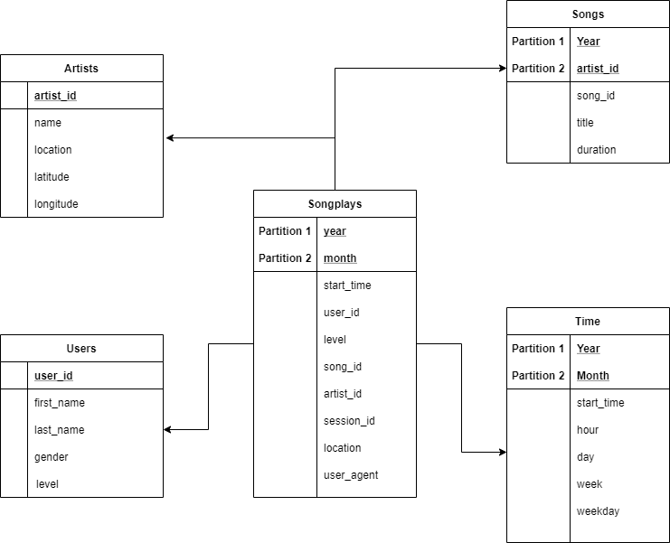

## Introduction
A startup called Sparkify has been collecting data on songs and user activity in JSON format. They are interested in efficiently performing 
song play analysis. Specifically, they want to know which songs do users prefer.

The goal of the current project is to create a Star Schema optimized for query analysis.

## About the Source Data
The dataset has been gathered from [Million Songs Dataset](https://labrosa.ee.columbia.edu/millionsong/) and logs simulated using 
[event simulator](https://github.com/Interana/eventsim)

## Project Description

The project performs the following steps on an EMR 3 node cluster to successfully achieve the goals:

1. Read the spark dataframes of songs and user activity (events)
2. Create spark dataframes according to the Star Schema (please look at the next section)
3. Save spark dataframes as parque files for efficient analysis

## Database Design


This is called a star schema, which is the industry standard for optimizing the desired queries. The table at the center is the *Fact* table 
(songplays) which contains the foreign keys to the *four dimension* tables. Through this design analytical queries such as the following are easy
to execute using simple joins.

~~~~sql
SELECT first_name, last_name, COUNT(*) AS counts 
FROM (songplays LEFT JOIN time ON songplays.start_time = time.start_time)
    LEFT JOIN users ON songplays.user_id = users.user_id 
GROUP BY first_name, last_name, weekday 
HAVING time.weekday=5 
ORDER BY counts DESC LIMIT 5;
~~~~

This query would return the top 5 active users on Fridays.

## Usage

### Setting the configuration

Set the AWS following variables in the config file:

1. AWS_ACCESS_KEY_ID
2. AWS_SECRET_ACCESS_KEY

### Executing the project

To execute the project run

#### Copy files to EMR home directory

You can use the following command to copy the executable files to EMR cluster

```
scp -i path-topemfile etl.py df.cfg hadoop@{MASTER_NODE_PUBLIC_DNS}:/home/hadoop/
```

**Note: You will need to set inbound rules to accept file transfer from the local machine**

To execute the project

```
spark-submit ./etl.py
```
